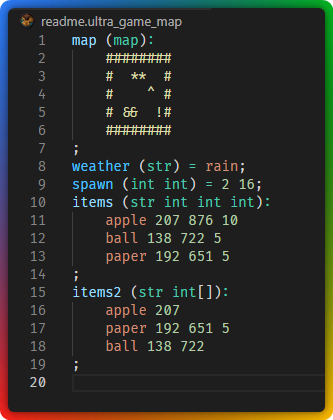

# .ultra_game_map File format

Values separated by **;**

Key and value separated by **=** or by **:** for list

List of values separated by line breaks

Before **=** and **:** you can write the field type in brackets **(_type_)**

Types:
Type  | Description
------|-------------
str   | string
num   | number
int   | integer
float | float
bool  | boolean
map   | string that is split into chars
any string   | custom type
**type**[]   | array of **type**, can only be the last one

# Examples

```
map:
	########
	#  **  #
	#    ^ #
	# &&  !#
	########
;
weather = rain;
spawn = 2 16;
items:
	apple 207 876 10
	ball 138 722 5
	paper 192 651 5
;
items2:
	apple 207
	paper 192 651 5
	ball 138 722
;
```
With types:
```
map (map):
	########
	#  **  #
	#    ^ #
	# &&  !#
	########
;
weather (str) = rain;
spawn (int int) = 2 16;
items (str int int int):
	apple 207 876 10
	ball 138 722 5
	paper 192 651 5
;
items2 (str int[]):
	apple 207
	paper 192 651 5
	ball 138 722
;
```